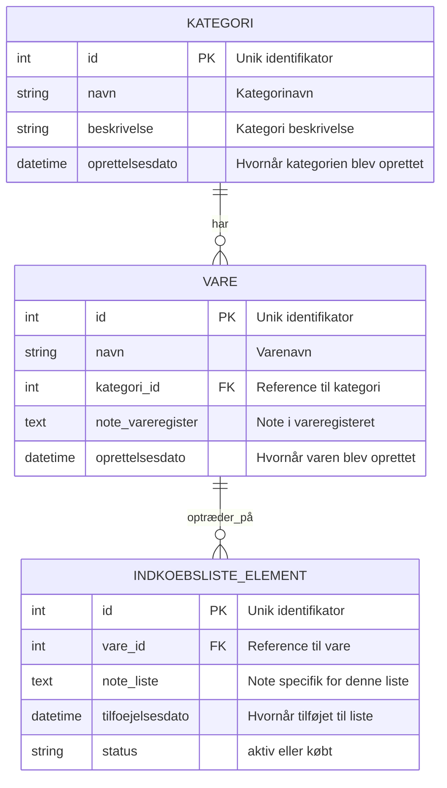

# Kravspecifikation - Indkøbsliste System

## 1. Projektbeskrivelse
Udvikling af et indkøbsliste system til familiehusholdninger, der gør det muligt at administrere varer, kategorier og indkøb på en struktureret måde.

## 2. Funktionelle Krav

### 2.1 Vareregistrering
- **FR-001**: Som bruger skal jeg kunne oprette en ny vare på indkøbslisten
- **FR-002**: Som bruger skal jeg kunne knytte en vare til en kategori
- **FR-003**: Som bruger skal jeg kunne knytte en note til varen i vareregisteret
- **FR-004**: Som bruger skal jeg kunne knytte en note til varen på listen

### 2.2 Kategoristyring
- **FR-005**: Som bruger skal jeg kunne oprette nye kategorier
- **FR-006**: Som bruger skal jeg kunne tildele varer til eksisterende kategorier

### 2.3 Søgning og Filtrering
- **FR-007**: Som bruger skal jeg kunne søge efter eksisterende varer
- **FR-008**: Som bruger skal jeg kunne filtrere varer ud fra kategori
- **FR-009**: Som bruger skal jeg kunne vælge flere kategorier på én gang ved filtrering

### 2.4 Listeadministration
- **FR-010**: Når en vare er købt, skal jeg kunne fjerne den fra listen
- **FR-011**: Som bruger skal jeg kunne se en oversigt over alle varer på indkøbslisten

## 3. Ikke-funktionelle Krav

### 3.1 Brugervenlighed
- **NFR-001**: Systemet skal have en intuitiv brugergrænseflad
- **NFR-002**: Alle handlinger skal kunne udføres med maksimalt 3 klik

### 3.2 Performance
- **NFR-003**: Søgning i vareregisteret skal returnere resultater inden for 2 sekunder
- **NFR-004**: Systemet skal kunne håndtere minimum 1000 varer

### 3.3 Datapersistering
- **NFR-005**: Data skal gemmes lokalt og være tilgængelig offline
- **NFR-006**: Systemet skal automatisk gemme ændringer

## 4. Datamodel

### 4.1 ER-Diagram



### 4.2 Entiteter

#### Vare
- ID (unik identifikator)
- Navn
- Kategori ID (reference)
- Note i vareregister
- Oprettelsesdato

#### Kategori
- ID (unik identifikator)
- Navn
- Beskrivelse
- Oprettelsesdato

#### Indkøbsliste-element
- ID (unik identifikator)
- Vare ID (reference)
- Note på liste
- Tilføjelsesdato
- Status (aktiv/købt)

## 5. Brugerhistorier

### Oprette vare
```
Som bruger
Ønsker jeg at oprette en ny vare
For at kunne tilføje den til min indkøbsliste
```

### Kategorisere varer
```
Som bruger
Ønsker jeg at organisere varer i kategorier
For at kunne finde dem nemmere senere
```

### Søge og filtrere
```
Som bruger
Ønsker jeg at kunne søge og filtrere varer
For hurtigt at finde specifikke produkter
```

### Administrere indkøb
```
Som bruger
Ønsker jeg at markere varer som købt
For at holde styr på hvad jeg mangler at købe
```

## 6. Acceptkriterier

### AC-001: Vareoprettelse
- Bruger kan indtaste varenavn
- Bruger kan vælge kategori fra dropdown
- Bruger kan tilføje valgfri note
- Vare gemmes i system ved bekræftelse

### AC-002: Kategorioprettelse
- Bruger kan oprette ny kategori med navn
- Kategori bliver tilgængelig i dropdown ved vareoprettelse
- Kategorier kan ikke have dublerede navne

### AC-003: Søgefunktionalitet
- Søgning fungerer på varenavn (partial match)
- Filtrering på kategori viser kun relevante varer
- Multiselect kategorier virker med AND/OR logik

### AC-004: Listeadministration
- Varer kan tilføjes til aktiv indkøbsliste
- Varer kan markeres som købt
- Købte varer fjernes fra aktiv liste
- Noter på liste er uafhængige af vareregister-noter

## 7. Tekniske Overvejelser

### 7.1 Platform
- Desktop applikation (Python-baseret)
- Lokal database (SQLite)
- Cross-platform kompatibilitet

### 7.2 Arkitektur
- Model-View-Controller (MVC) pattern
- Separation af vareregister og aktiv indkøbsliste
- Modulær struktur for nem vedligeholdelse

## 8. Fremtidige Udvidelser
- Synkronisering mellem enheder
- Deling af lister mellem familiemedlemmer
- Prisregistrering og budgettering
- Integration med online butikker
- Historik over tidligere indkøb